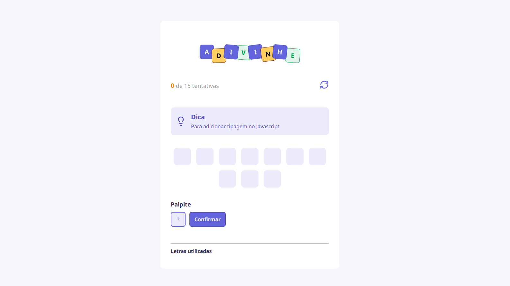

# Adivinhe! - Jogo de Adivinhação de Palavras



Este é um simples jogo de adivinhação de palavras construído com React, TypeScript e Vite. O objetivo do jogo é adivinhar a palavra secreta, que está relacionada a tecnologias de desenvolvimento web.

## ✨ Funcionalidades

- **Palavras Aleatórias**: A cada novo jogo, uma palavra é selecionada aleatoriamente de uma lista predefinida.
- **Dicas**: Cada palavra vem com uma dica para ajudar o jogador.
- **Feedback Visual**: As letras utilizadas são exibidas, com cores diferentes para acertos e erros.
- **Contador de Tentativas**: O jogador tem um número limitado de tentativas para adivinhar a palavra.
- **Reiniciar Jogo**: É possível reiniciar o jogo a qualquer momento.

## 🚀 Tecnologias Utilizadas

- **[React](https://react.dev/)**: Biblioteca para construir a interface do usuário.
- **[TypeScript](https://www.typescriptlang.org/)**: Superset do JavaScript que adiciona tipagem estática.
- **[Vite](https://vitejs.dev/)**: Ferramenta de build moderna e rápida para desenvolvimento web.
- **CSS Modules**: Para estilização local e componentizada.

## 🏁 Como Executar o Projeto

Siga os passos abaixo para executar o projeto em seu ambiente de desenvolvimento.

### Pré-requisitos

- [Node.js](https://nodejs.org/) (versão 18 ou superior)
- [npm](https://www.npmjs.com/) ou outro gerenciador de pacotes (yarn, pnpm)

### Instalação e Execução

1.  Clone o repositório:
    ```sh
    git clone https://github.com/Batavoo/jogo_adivinhacao_react
    ```
2.  Navegue até o diretório do projeto:
    ```sh
    cd jogo_adivinhacao
    ```
3.  Instale as dependências:
    ```sh
    npm install
    ```
4.  Inicie o servidor de desenvolvimento:
    ```sh
    npm run dev
    ```
5.  Abra seu navegador e acesse `http://localhost:5173` (ou a porta indicada no terminal).

## 📂 Estrutura do Projeto

O código-fonte está localizado na pasta `src/` e segue a seguinte estrutura:

```
src/
├── assets/         # Imagens e ícones estáticos
├── components/     # Componentes React reutilizáveis
├── utils/          # Funções e dados utilitários (ex: lista de palavras)
├── App.tsx         # Componente principal da aplicação com a lógica do jogo
├── main.tsx        # Ponto de entrada da aplicação React
└── global.css      # Estilos globais
```

## 📄 License

This project is for educational and demonstration purposes.

---

<p align="center">Made with ❤️ by <a href="https://www.linkedin.com/in/gustavo-santos-744549234/">Gustavo Arruda</a></p>
